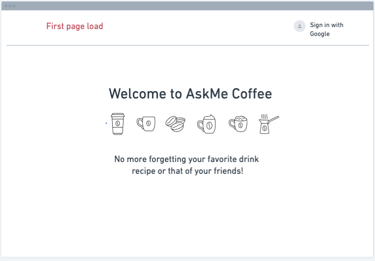
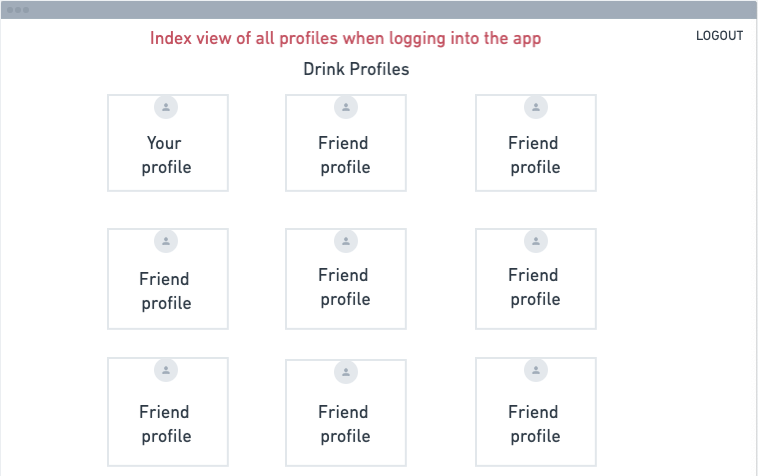
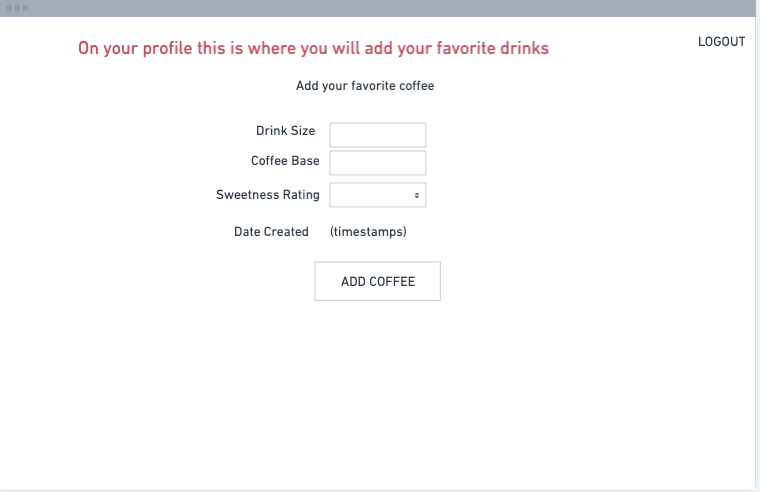
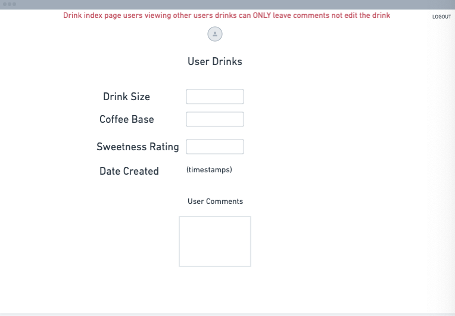
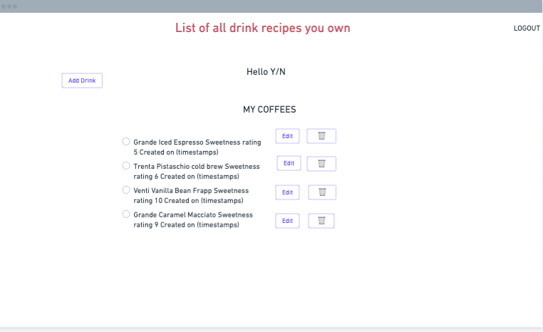
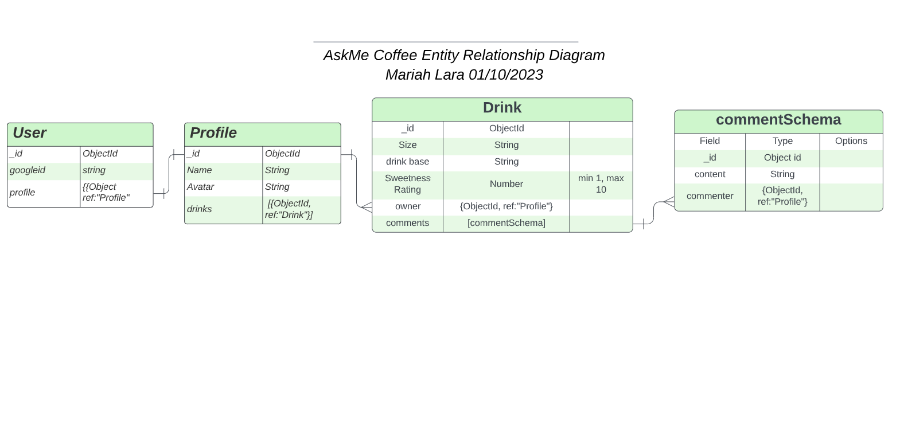

<h1> Welcome to AskMe Coffee!</h1>

<h2> The AskMe Coffee app stores your favorite coffee combinations and allows you to view your friend's drins and possibly try them the next time you are in line for coffee.</h2>

<h2>
<a href="https://askmecoffee.fly.dev/"> Click here and get your next coffee!</a>
</h2>

<a href="https://trello.com/invite/b/QXgQscWT/ATTI0050b7605840b13859173e7333e72a7cBBA23BFE/askme-coffee"> Here is my planning board. Check it out!</a>

<h3>Here are some images of my wireframe.</h3>

<h3>Take a look at my Entity Relationship Diagram<h3>

<h2> NEXT STEPS/ ICE BOX 🧊 </h2>

<ol>
  <li>Create a dark mode theme to the app.</li>
  <li>Interact with the API that our app will expose to create, view all, and delete ingredients. Ingredients will have a name.</li>
  <li>I should be able to associate ingredients with that drink from the drink detail page.</li>
</ol>

<h3> Technologies Used: </h3>

<ul>
  <li> HTML</li>
  <li>JavaScript</li>
  <li>CSS</li>
  <li> Node.js</li>
  <li>Express</li>
  <li>Azure</li>
  <li> Google OAuth</li>
  <li>Fly.io</li>
  <li>Mongoose</li>
  <li> MongoDB</li>
  <li>Trello</li>
  <li>Github</li>
</ul>

<h3> Credits <h3>
Main page image coffee collage

 

 Color Theme: [Coolors.co](https://coolors.co)
